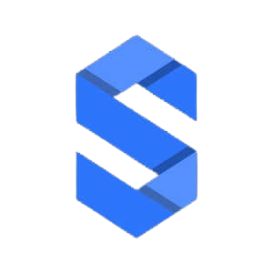

# 🚀 SERVIJAM: Gestión de Impresión 3D en Red

  

## 📝 Resumen del Proyecto
[cite_start]**Servijam** es una plataforma completa diseñada para la gestión profesional de servicios de impresión 3D en red[cite: 31]. [cite_start]El sistema permite el control remoto, seguro y eficiente de los procesos de impresión mediante una arquitectura modular basada en **Raspberry Pi**[cite: 26]. [cite_start]Está orientado a entornos colaborativos como centros educativos, laboratorios de prototipado o espacios maker[cite: 25].

---

## 📂 Índice de Contenidos

Explora los módulos que componen la infraestructura de Servijam:

| Carpeta | Descripción | Stack Principal |
| :--- | :--- | :--- |
| [📁 Cap 1. Introducción](./Capítulo-1-Introducción) | [cite_start]Objetivos y requisitos funcionales/técnicos del sistema[cite: 35]. | `Documentación` |
| [📁 Cap 2. Base teórica](./Capítulo-2-Base-teórica) | [cite_start]Esquema de red e infraestructura (Tailscale, Moonraker, Docker)[cite: 38]. | `Infraestructura` |
| [📁 Cap 3. Desc. experimental](./Capítulo-3-Descripción-experimental) | [cite_start]Desarrollo de la web interactiva y gestión de la base de datos[cite: 42]. | `PHP` `MariaDB` |
| [📁 Cap 4. Conclusiones](./Capítulo-4-Conclusiones-y-líneas-futuras) | [cite_start]Validación del entorno y propuestas de escalabilidad (2FA, Granjas)[cite: 45]. | `Análisis` |

---

## 🛠️ Tecnologías y Herramientas

### 🗄️ Gestión de Datos y Backend

  
  
  
  

### 🛡️ Red y Conectividad Segura

  
  
  
  

### 🖨️ Ecosistema de Impresión 3D
* [cite_start]**Klipper:** Firmware para el control de la impresora[cite: 75].
* [cite_start]**Moonraker:** API REST para la comunicación con la interfaz[cite: 121].
* [cite_start]**Fluidd:** Interfaz gráfica de monitorización[cite: 140].
* [cite_start]**Kiri:Moto:** Laminador integrado para preparación de G-code[cite: 573].

---

## 🌟 Hitos Técnicos (ASIR)

* [cite_start]**🔐 Conectividad Overlay:** Implementación de túneles **WireGuard** mediante Tailscale para conexión directa entre nodos tras NAT[cite: 94, 97].
* [cite_start]**🐳 Contenerización:** Despliegue de microservicios orquestados con **Docker Compose** para asegurar la portabilidad del sistema[cite: 201].
* [cite_start]**📡 Monitorización Real-time:** Uso de **WebSockets** para actualizar temperaturas y estados de impresión sin recargar la web[cite: 135].
* [cite_start]**🏗️ Modelo Relacional:** Base de datos optimizada en **MariaDB** con relación 1:N entre usuarios y trabajos de impresión[cite: 857, 859].

---

## 🤝 Autores
* [cite_start]**Juan Carlos Hernández Risso** [cite: 7]
* [cite_start]**Arturo Manso Borrego** [cite: 7]
* [cite_start]**Marco Antonio Méndez Rivero** [cite: 7]

[cite_start]**Tutor:** Alberto Fernández Sánchez [cite: 6]  
[cite_start]**Institución:** Colegio Institución La Salle (Madrid) [cite: 10, 17]

---

  <a href="https://www.linkedin.com/in/marco-antonio-m%C3%A9ndez-rivero-a8a85628a" target="_blank">
    <b>🔗 Mi LinkedIn</b>
  </a>

---
[cite_start]
 © 2025 SERVIJAM - Licencia Creative Commons BY-NC 4.0 [cite: 8, 23] 

